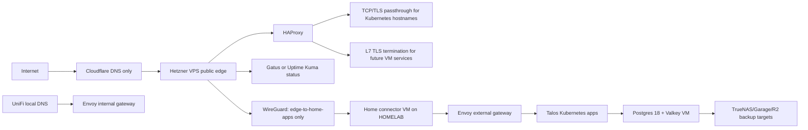

# Nimbus Casa Infrastructure Architecture

Target architecture for the Nimbus Casa homelab: a Hetzner VPS public edge, WireGuard backhaul, HAProxy routing, GitOps-managed Kubernetes, and scriptable host infrastructure with minimal third-party runtime dependency.

Last updated: 2026-04-23

## Goals

- Replace Cloudflare Tunnel as the primary ingress path.
- Keep Cloudflare DNS, but avoid depending on Cloudflare for traffic proxying.
- Use the Hetzner VPS as the public edge and basic outside-home observability point.
- Use the VPS as both:
  - TLS passthrough edge for all Kubernetes services attached to Envoy external.
  - L7 TLS-terminating frontend for selected future services hosted on separate Proxmox VMs.
- Keep home services private by default, with narrow, auditable paths from the VPS into Kubernetes.
- Move shared Postgres and Valkey out of Kubernetes into a dedicated Proxmox VM.
- Make the VPS, database VM, and eventually Proxmox VM lifecycle reproducible from this repository.
- Prefer boring, recoverable tools over enterprise-heavy platforms.

## Existing State

- One Proxmox node.
- TrueNAS Scale VM with disks passed through via PCI passthrough.
- One Talos Linux VM running a single-node Kubernetes cluster at `10.10.40.40`.
- Cilium LB IPs on the `10.10.40.0/24` network.
- Envoy Gateway:
  - internal gateway: `10.10.40.61`
  - external gateway: `10.10.40.62`
- External DNS currently manages Cloudflare records from Gateway/HTTPRoute and DNSEndpoint resources.
- Some services are exposed through Cloudflare Tunnel.
- Jellyfin currently works through HAProxy on the Hetzner VPS over Tailscale to Envoy Gateway.
- Concern: the Tailscale path can expose too much of the home network to the VPS.

## Architecture Decisions

- Hetzner VPS is the public entry point for the whole infrastructure.
- VPS reverse proxy stack should be HAProxy + WireGuard.
- Kubernetes public traffic should use TLS passthrough from VPS HAProxy to Envoy external.
- HAProxy should preserve accurate client information for logs where technically possible.
- VPS should also support L7 TLS termination for future non-Kubernetes VM services.
- Use a dedicated home connector VM with HAProxy rather than terminating the VPS tunnel directly in Kubernetes.
- Cloudflare should be DNS-only everywhere; no Cloudflare proxying and no Cloudflare Tunnel dependency.
- `envoy-external` routes are internet-routable only through the VPS.
- `envoy-internal` routes remain home-network-only through UniFi local DNS pointing at the internal Envoy gateway.
- Keep Proxmox guests on the HOMELAB VLAN.
- Connector VM target IP: `10.10.40.21`.
- Database VM target IP: `10.10.40.22`.
- Database VM target OS: Ubuntu Server 26.04 LTS.
- Postgres backup design should continue using pgBackRest to Garage and R2, with WAL and more frequent backups going only to Garage.

## Home Network Model

VLANs:

- `10.10.1.0/24` MGMT: UniFi hardware, Proxmox UI, TrueNAS UI, administrative interfaces.
- `10.10.10.0/24` LAN: trusted user devices.
- `10.10.20.0/24` IOT: untrusted smart home devices.
- `10.10.40.0/24` HOMELAB: Proxmox guests and infrastructure services.

Policy direction:

- Proxmox guests live only on HOMELAB.
- MGMT can administer Proxmox/TrueNAS/UniFi and selected infrastructure.
- LAN can reach selected internal services through `envoy-internal`.
- IOT should have minimal egress and only explicitly-needed access to services such as Home Assistant, DNS, NTP, or mDNS reflectors if used.
- HOMELAB east-west access should not be assumed; DB and connector VMs should still have host firewalls.
- VPS must never receive a route to MGMT, LAN, IOT, or the full HOMELAB subnet.

HOMELAB known addresses:

- `10.10.40.1`: UniFi gateway for HOMELAB.
- `10.10.40.10`: TrueNAS.
- `10.10.40.20`: Proxmox host HOMELAB address.
- `10.10.1.20`: Proxmox host MGMT address.
- `10.10.40.21-10.10.40.39`: static VM IP reservation range.
- `10.10.40.41-10.10.40.99`: Kubernetes node/LB/service IP reservation range.
- `10.10.40.100-10.10.40.250`: DHCP range.

Reserved static addresses:

- `10.10.40.21`: home connector VM.
- `10.10.40.22`: database VM.
- `10.10.40.62`: Envoy external gateway, already in use.
- `10.10.40.61`: Envoy internal gateway, already in use.

## Infrastructure As Code

Use three IaC layers:

1. **Kubernetes apps:** keep Flux as the source of truth for Kubernetes workloads, Gateway API routes, cert-manager, external-dns, app secrets, and in-cluster monitoring.
2. **Machine creation:** use OpenTofu/Terraform for Proxmox-created VMs, starting with the connector VM and database VM. Optionally add Hetzner Cloud resources later, but since the VPS is manually created, do not force Hetzner into Terraform on day one.
3. **Machine configuration:** use Ansible for the Hetzner VPS, connector VM, and database VM OS/application configuration.

This split is intentionally simple. Terraform/OpenTofu is good at declarative resources such as Proxmox VMs, disks, NICs, cloud-init snippets, and DNS/server resources. Ansible is better at converging an already-existing Linux host: packages, files, services, firewall rules, Docker/Podman Compose, HAProxy, WireGuard, Postgres, Valkey, backups, and exporters.

Chef/Puppet/Salt feel too heavy for a single-user homelab unless you specifically want a long-lived configuration management server. Shell scripts are tempting but tend to become hard to safely re-run. Ansible gives us idempotence, SSH transport, readable YAML, and no agent.

## High-Level Architecture



The key security boundary is that the VPS does not get a route to the whole home network. It gets a point-to-point WireGuard tunnel to the dedicated home connector VM, and that connector only forwards to explicitly-approved HOMELAB destinations.

## Public Ingress

DNS:

- `service.example.com CNAME external.example.com`
- `external.example.com A/AAAA Hetzner_VPS_IP`

Traffic:

- Client connects to `service.example.com`.
- For Kubernetes services, VPS HAProxy TCP frontends pass TLS through over WireGuard.
- Home connector forwards the TCP stream to Envoy external.
- Envoy terminates TLS and routes based on SNI/HTTP `Host`.
- Wildcard `*.nimbus.casa` should be treated as Kubernetes TLS passthrough and forwarded to Envoy external.
- For future VM services, VPS HAProxy can terminate TLS at L7 and proxy HTTP to the target VM over WireGuard/home connector paths or other restricted HOMELAB paths.
- Connector firewall allows the WireGuard peer to reach only approved connector HAProxy listener ports.

## VPS Design

Baseline services:

- Reverse proxy: HAProxy.
- WireGuard.
- Firewall: nftables or UFW with explicit allows for SSH, HTTP, HTTPS, WireGuard UDP.
- Observability:
  - Gatus if we want config-as-code and simple blackbox checks.
  - Uptime Kuma if we want an interactive status UI and easy manual checks.
  - Prometheus node_exporter and cAdvisor are optional; keep it small unless needed.
- Automatic updates: unattended-upgrades with clear reboot policy.
- Backup/export: push `/etc`, reverse proxy config, and monitoring config into Git; app state for Uptime Kuma needs volume backup if chosen.

Responsibilities:

- Run HAProxy as the primary public frontend.
- Run one TCP/TLS passthrough path for Kubernetes hostnames that should land on Envoy external.
- Run separate HTTP-mode frontends/backends for future VM services where the VPS terminates TLS.
- Maintain public-edge logs that include original client IPs.

For the current Envoy setup, use **HAProxy with TCP/TLS passthrough first**, because Kubernetes already owns Gateway TLS certs and routes. The VPS can expose `:443` and forward encrypted traffic over WireGuard to Envoy. That avoids duplicating public TLS termination for Kubernetes services.

For future VM-hosted services, use HAProxy HTTP mode with ACME-managed certificates on the VPS. Those services should be listed explicitly in HAProxy config and should not get implicit access to the whole HOMELAB VLAN.

### HAProxy Routing Shape

Likely routing model:

- `:443` public frontend inspects SNI.
- If SNI matches a Kubernetes-hosted public hostname, route in TCP mode to the home connector, then to Envoy external.
- If SNI matches a VPS-terminated VM service hostname, route to an HAProxy HTTPS frontend/backend that terminates TLS and adds headers.
- `:80` redirects to HTTPS, except ACME HTTP-01 if used.

Client IP policy:

- For L7 terminated services: set `X-Forwarded-For`, `X-Real-IP`, `Forwarded`, and `X-Forwarded-Proto`.
- For Kubernetes TLS passthrough: evaluate HAProxy PROXY protocol v2 from VPS to connector to Envoy. This requires Envoy Gateway support/configuration for accepting PROXY protocol on the listener path. If that is not clean, accept that Kubernetes app logs see proxy/connector IPs and rely on HAProxy edge logs as the source of truth for public client IPs.

The edge logs on the VPS are authoritative for public client IPs. PROXY protocol into Envoy Gateway is an optimization to test after the basic path is stable.

## WireGuard Design

Target addressing:

- VPS WireGuard: `10.200.0.1/32`
- Home connector WireGuard: `10.200.0.2/32`
- No `AllowedIPs = 10.10.0.0/16` on the VPS.
- VPS peer allowed IPs: only `10.200.0.2/32`.
- Home connector peer allowed IPs: only `10.200.0.1/32`.

Forwarding:

- VPS reverse proxy upstream for Kubernetes TLS passthrough is connector HAProxy on `10.200.0.2:443`.
- Connector HAProxy forwards Kubernetes TLS passthrough traffic to `10.10.40.62:443`.
- Connector HAProxy forwards explicitly configured future VM service traffic to approved HOMELAB backend IPs.
- Connector firewall allows only WireGuard peer traffic from `10.200.0.1` to approved local HAProxy listener ports.
- Kubernetes NetworkPolicy/Gateway routes still control app-level exposure.

This avoids giving the VPS a routable path to NAS, Proxmox, management VLANs, or arbitrary pods.

## Home Connector VM

Placement:

- Tiny Ubuntu Server or Debian VM on Proxmox in HOMELAB.
- Static HOMELAB IP: `10.10.40.21`.
- WireGuard interface `10.200.0.2/32`.
- Host firewall permits inbound WireGuard tunnel traffic only from `10.200.0.1`.
- Host firewall permits connector HAProxy egress only to approved HOMELAB destinations such as `10.10.40.62:443`.
- No routed access from VPS to `10.10.40.0/24`.

Shape:

- VPS HAProxy sends TCP traffic over WireGuard to connector HAProxy.
- Connector HAProxy forwards TCP to `10.10.40.62:443`.
- Connector HAProxy can add PROXY protocol toward Envoy if Envoy is configured for it.
- Connector HAProxy can also expose explicit backends for future VM services if we want all cross-boundary traffic to pass through one audited process.

Responsibilities:

- Better health checks from the connector to Envoy and future VM backends.
- Real connection logs on both sides of the tunnel.
- Can participate in PROXY protocol handling.
- Cleaner future expansion for multiple HOMELAB backends.
- Easier to temporarily drain/disable one backend without changing firewall NAT.
- Keep nftables as the hard security boundary. HAProxy is routing/control; nftables is enforcement.

## DNS Plan

Keep external-dns managing Cloudflare DNS. Replace the Cloudflare Tunnel DNSEndpoint with:

- `external.${SECRET_DOMAIN}` as `A` and optionally `AAAA` to the Hetzner VPS.
- Service HTTPRoutes continue to produce `CNAME service.${SECRET_DOMAIN} -> external.${SECRET_DOMAIN}` via the existing `external-dns.alpha.kubernetes.io/target` annotation.
- `*.nimbus.casa` should ultimately route through the VPS to Envoy external with TLS passthrough, while internal-only hostnames should resolve locally through UniFi to Envoy internal.

Important change needed in the repo:

- Remove `--cloudflare-proxied` from the Cloudflare external-dns HelmRelease, or otherwise ensure records are DNS-only.
- Replace the current Cloudflare Tunnel DNSEndpoint target with the Hetzner VPS address/hostname.
- Keep UniFi local DNS for internal-only names pointing at `envoy-internal`.

Policy:

- Cloudflare DNS-only everywhere.
- No Cloudflare Tunnel as a runtime ingress dependency.
- `envoy-external` means public through VPS.
- `envoy-internal` means private via UniFi/home DNS only.

## Database VM Plan

Purpose:

- Host Postgres 18 and Valkey outside Kubernetes.
- Give stateful services a more stable persistence boundary than the single-node Kubernetes storage layer.
- Keep data close to the cluster on the same Proxmox host/network.

VM:

- Ubuntu Server 26.04 LTS.
- Separate OS disk and data disk.
- Static IP on HOMELAB: `10.10.40.22`.
- Firewall allows Postgres `5432` and Valkey `6379` only from Kubernetes node/pod CIDRs or a narrow service VLAN.
- Optional local-only admin access via SSH from management VLAN.

Postgres:

- Install Postgres 18 from PGDG apt repository if the distro does not ship the desired version.
- Use roles/databases managed by Ansible.
- Use TLS for app connections if crossing VLANs.
- Use `pgbackrest` for backups.
- Export metrics with postgres_exporter.

Backup policy:

- Continue the current two-repository shape:
  - repo1: Garage, primary and frequent.
  - repo2: Cloudflare R2, less frequent offsite.
- WAL archiving and frequent incremental/differential backup cadence go only to Garage.
- R2 keeps the lower-frequency offsite retention copy.
- Preserve the spirit of the current Crunchy `pgbackrest` config while moving ownership into Ansible-managed host config.

Valkey:

- Install distro package where available.
- Bind to the DB VM's HOMELAB IP only.
- Enable protected mode/auth.
- Choose persistence deliberately:
  - cache-only: no AOF/RDB, simplest.
  - durable queues/sessions: AOF every second plus backups/snapshots.

Migration:

1. Build DB VM with OpenTofu + cloud-init.
2. Configure Postgres 18 and Valkey with Ansible.
3. Create databases/users matching current Kubernetes secrets.
4. Dump/restore from Crunchy Postgres 16 to Postgres 18 per app.
5. Update ExternalSecrets/application env vars to point to DB VM.
6. Cut apps over one by one.
7. Keep Crunchy cluster read-only/paused until rollback window expires.

## Proxmox IaC Plan

Use OpenTofu/Terraform with the `bpg/proxmox` provider for VM lifecycle.

Likely repository layout:

```text
infrastructure/
  opentofu/
    proxmox/
      providers.tf
      variables.tf
      connector-vm.tf
      db-vm.tf
      outputs.tf
      cloud-init/
        connector-user-data.yaml.tftpl
        connector-network-data.yaml.tftpl
        db-user-data.yaml.tftpl
        db-network-data.yaml.tftpl
  ansible/
    inventory.yml
    site.yml
    group_vars/
    roles/
      common/
      wireguard/
      edge_proxy/
      connector_proxy/
      postgres/
      valkey/
      node_exporter/
```

Proxmox provider responsibilities:

- Create VM from cloud image/template.
- Attach cloud-init drive.
- Configure CPU, memory, NIC/VLAN, disks.
- Set SSH user/key and initial network.
- Output VM IP for Ansible inventory.

Ansible responsibilities:

- Harden SSH.
- Install packages.
- Write service configs.
- Manage systemd services.
- Manage firewall.
- Manage Postgres users/databases.
- Manage Valkey config.
- Manage WireGuard and edge proxy config.
- Manage connector HAProxy and firewall policy.

## Secrets

Current repo uses SOPS for Kubernetes secrets. Extend that idea:

- Keep Ansible inventory and non-secret vars in Git.
- Store host secrets as SOPS-encrypted YAML, ideally age-encrypted with the same operational model.
- Do not put WireGuard private keys or database passwords in Terraform state.
- Generate WireGuard keys outside Terraform or with Ansible and store encrypted.
- Terraform state should be local initially or in an encrypted backend you control. Avoid cloud state services.

## Observability Plan

VPS should monitor from the outside:

- Public HTTPS for each exposed service.
- WireGuard peer health.
- Envoy upstream reachability over the tunnel.
- VPS disk, memory, load, and service health.
- Optional status page at `status.${SECRET_DOMAIN}`.

Home Kubernetes should monitor from the inside:

- Node, pod, Gateway, certificate, and storage health.
- DB VM Postgres/Valkey exporters.
- Backup freshness.
- Tunnel health from home side.

Decision:

- Keep in-cluster Gatus if useful for internal checks.
- Run a small VPS Gatus instance for external checks and status page if config-as-code matters most.
- Use Uptime Kuma only if its UI is more important than fully declarative config.

## Research Notes

- Ansible communicates over SSH and uses inventories/playbooks for remote machine configuration, which fits manually-created Hetzner hosts and Proxmox VMs that already have SSH keys.
- Hetzner Cloud supports cloud-init/user-data for servers, and both Terraform and Ansible have Hetzner integrations, but we do not need them immediately if the VPS is manually created.
- Proxmox supports cloud-init through generated ISO data; the bpg Proxmox Terraform/OpenTofu provider supports cloud-init initialization and custom user-data snippets.
- Proxmox API supports token authentication, which is preferable for automation over password-based access.
- Talos KubeSpan is WireGuard-based and useful for multi-node/multi-site clusters, but it is not the cleanest answer for a public edge proxy into a single-node home cluster.
- Tailscale subnet routers are designed to expose non-Tailscale subnets into a tailnet; that is exactly the feature to avoid or tightly constrain for the VPS.
- PostgreSQL's official apt repository is the path for installing supported versions such as Postgres 18 when distro defaults lag.
- Valkey has Debian/Ubuntu package installation paths and can be run as a system service.

Sources:

- Ansible getting started: https://docs.ansible.com/ansible/2.10/user_guide/intro_getting_started.html
- Hetzner Ansible collection: https://docs.ansible.com/projects/ansible/latest/collections/hetzner/hcloud/server_module.html
- Hetzner Terraform provider server resource: https://registry.terraform.io/providers/hetznercloud/hcloud/latest/docs/resources/server
- Proxmox Cloud-Init support: https://pve.proxmox.com/wiki/Cloud-Init_Support
- Proxmox API: https://pve.proxmox.com/mediawiki/index.php?title=Proxmox_VE_API
- bpg Proxmox provider cloud-init guide: https://registry.terraform.io/providers/bpg/proxmox/latest/docs/guides/cloud-init
- Talos KubeSpan: https://www.talos.dev/latest/talos-guides/network/kubespan/
- Tailscale subnet routers: https://tailscale.com/kb/1019/subnets
- Tailscale ACL syntax: https://tailscale.com/kb/1337/acl-syntax/
- Ubuntu release cycle: https://ubuntu.com/about/release-cycle
- Ubuntu 26.04 release announcement: https://lists.ubuntu.com/archives/ubuntu-announce/2026-April/000323.html
- PostgreSQL Debian packages: https://www.postgresql.org/download/linux/debian/
- Valkey installation: https://valkey.io/topics/installation/

## Implementation Inputs

These are not architecture blockers, but they are needed before writing the first full Ansible/OpenTofu implementation:

- Hetzner VPS public IPv4/IPv6 addresses.
- Hetzner VPS SSH username and target OS image.
- Proxmox API token details and storage/network bridge names.
- Final VM sizing for the connector VM and database VM.
- Whether connector HAProxy should send PROXY protocol to Envoy external after testing Envoy Gateway support.
- Exact list of future VM service hostnames and backend IPs once those VMs exist.
- Postgres backup retention windows for Garage and R2.
- Postgres network policy choice: accept from Talos node IP only, pod CIDRs, or a controlled egress/NAT path.

## Implementation Sequence

1. Add OpenTofu/Proxmox skeleton for connector VM and database VM.
2. Add Ansible skeleton for common host baseline, WireGuard, HAProxy, firewall, observability, Postgres, Valkey, and pgBackRest.
3. Provision connector VM at `10.10.40.21`.
4. Configure WireGuard between VPS `10.200.0.1` and connector `10.200.0.2`.
5. Configure VPS HAProxy for `*.nimbus.casa` TLS passthrough to connector HAProxy.
6. Configure connector HAProxy to forward Kubernetes passthrough traffic to Envoy external at `10.10.40.62:443`.
7. Remove Cloudflare proxying and replace Cloudflare Tunnel DNS target with the Hetzner VPS.
8. Test public ingress and logs before decommissioning Cloudflare Tunnel.
9. Provision database VM at `10.10.40.22`.
10. Configure Postgres 18, Valkey, pgBackRest, exporters, and firewall policy.
11. Migrate apps from in-cluster Postgres/Dragonfly to the database VM one service at a time.

## Open Risks

- Single Proxmox host remains the largest availability boundary.
- Public exposure through Hetzner means the VPS is now a high-value host and needs tight firewalling, automatic patching, minimal services, and clear backups.
- TLS passthrough makes the VPS simpler but reduces edge-layer visibility into HTTP health/routing.
- TLS termination on the VPS improves edge observability/control but duplicates certificate and route configuration.
- Moving Postgres from Crunchy to a VM removes operator-managed conveniences; Ansible must cover users, backups, upgrades, metrics, and restore runbooks.
- Terraform/OpenTofu state can leak sensitive data if secrets are placed there; keep secrets out of resource definitions where possible.
